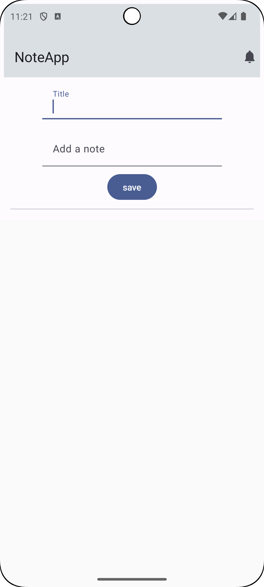
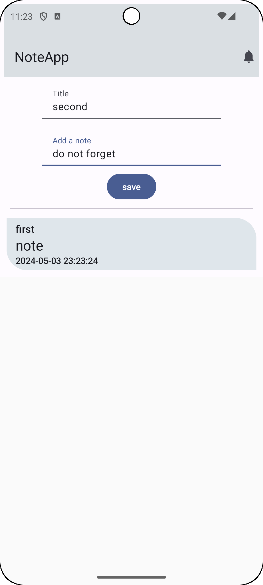
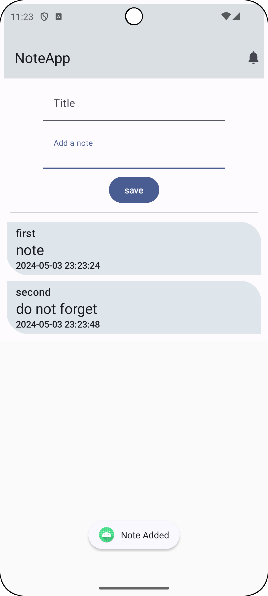

# NoteApp

- メモアプリ

## 技術仕様

 

## 画面仕様

 画面表示時                      | メモ追加                      | メモ保存                       
----------------------------|---------------------------|----------------------------
  |  |  
 追加したメモを表示する                | タイトル、メモを入力する              | saveボタンタップでメモを保存する         
